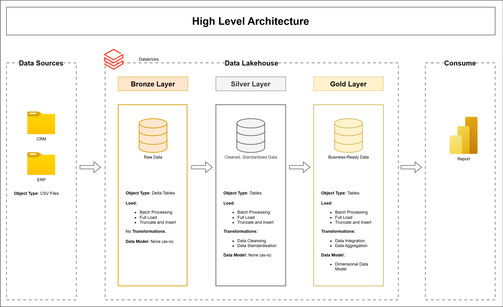
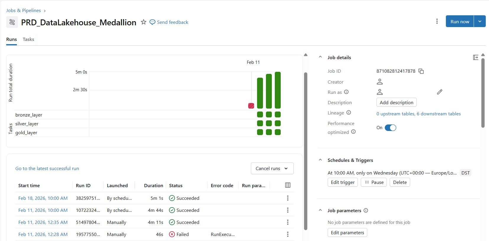
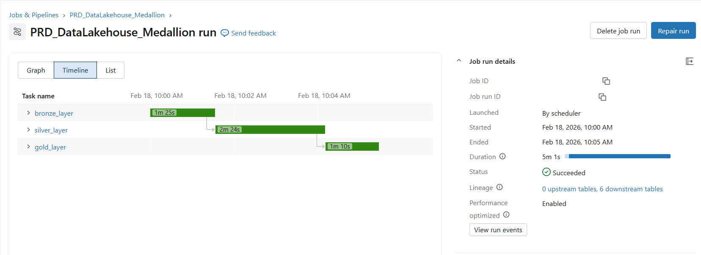

# Databricks Data Lakehouse Project

This project demonstrates the implementation of a **Data Lakehouse** using **Databricks** and the **Medallion Architecture**. The workflow focuses on processing and refining raw data (CSV format) into actionable insights through a structured multi-layer approach.

---

## 📖 Project Overview
This project involves:
1. **Data Architecture:** Designing a modern Data Lakehouse utilizing the **Medallion Architecture** (Bronze, Silver, and Gold layers) to manage data evolution and quality.
2. **Data Processing & Transformation:** Ingesting CSV datasets into the Bronze layer and leveraging **Apache Spark (PySpark & Spark SQL)** to perform cleaning, validation, and complex transformations. 
3. **Data Governance:** Utilizing **Unity Catalog** for centralized metadata management and ensuring data integrity across the Lakehouse layers.
4. **Data Modeling:** Developing **Fact and Dimension tables** (Star Schema) in the Gold layer, optimized for high-performance analytical queries and BI tools.

---

## 🏗️Data Architecture

This project follows the **Medallion Architecture**:

### 🥉 Bronze Layer
- Raw data ingestion
- Schema inference and storage as Delta tables

### 🥈 Silver Layer
- Data cleaning and standardization
- Type casting and validation

### 🥇 Gold Layer
- Dimensional Data Model (Business Transformation)
- Ready for BI and analysis

---

## 🛠️ Technologies Used

- Databricks
- Apache Spark
- PySpark
- Spark SQL
- Delta Lake
- Unity Catalog

## Pipeline Execution & Monitoring
To ensure the reliability and automation of the Lakehouse, the project implements and monitors data workflows using **Databricks Jobs** and **Unity Catalog**.

1. **Automated Workflows & Job History**

The project utilizes scheduled jobs to trigger the end-to-end Bronze-to-Gold transformation sequence. This orchestration ensures that the data pipeline remains consistent and resilient.

- Verified Execution: Detailed logs confirm that each stage, including Ingestion, Cleaning, and Aggregation, completes without errors.

- Operational Reliability: The history reflects consistent performance across multiple automated runs.

2. **Execution Performance & Timeline**

Each stage of the Medallion Architecture is monitored to ensure optimal Spark resource utilization and processing efficiency.

- Task Orchestration: The timeline visualizes the precise duration of transformations across the Bronze, Silver, and Gold layers.

- Performance Tracking: Execution metrics allow for the identification and resolution of potential processing bottlenecks.

3. **Data Lineage & Governance**

Through the integration of Unity Catalog, the project features automated data lineage, establishing a "single source of truth" for all data assets.

- Data Traceability: A comprehensive map illustrates how raw CSV data evolves into refined business-ready insights.

- Auditability & Trust: Data integrity is maintained by tracking every transformation and dependency across the Lakehouse environment.